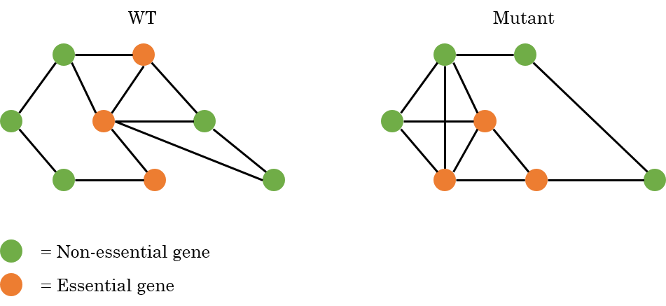
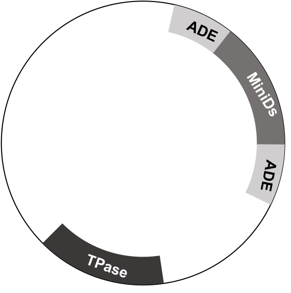
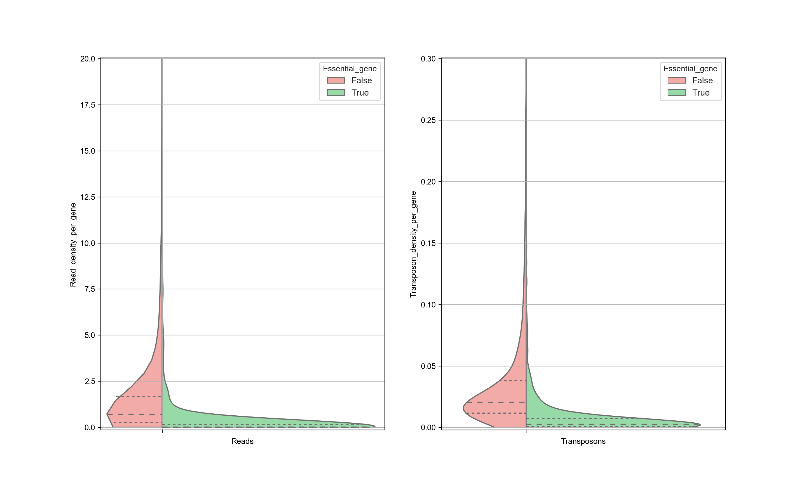
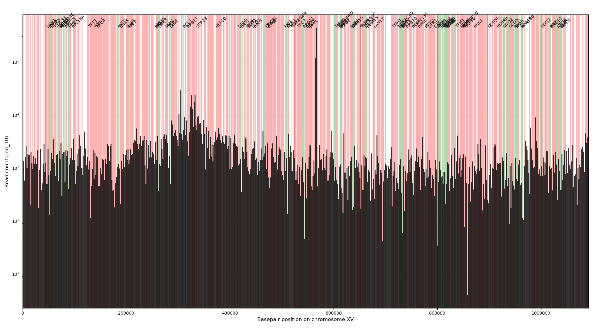
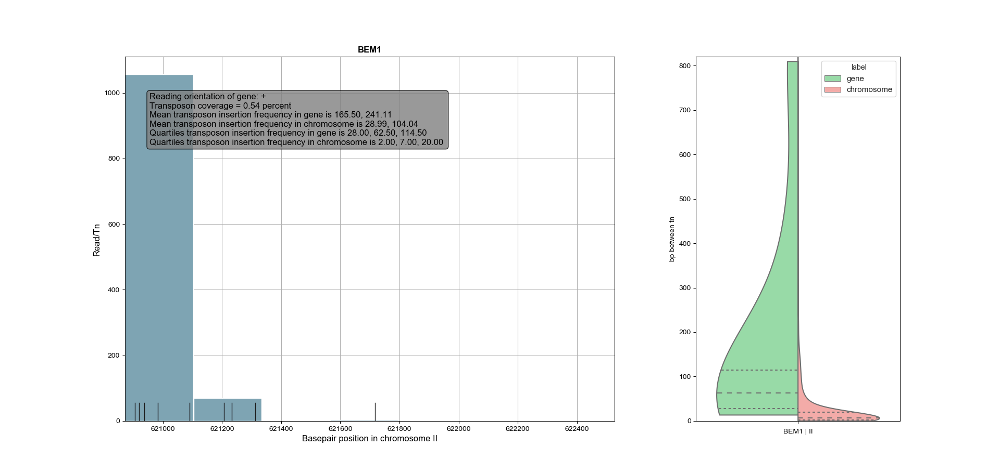
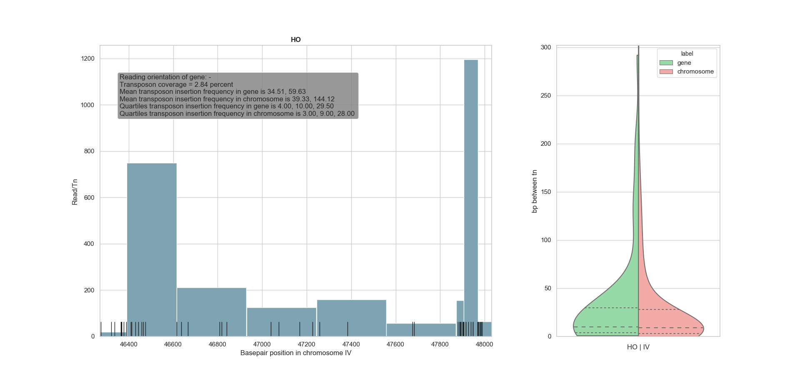

# Introduction

About 20% of the genes in wild type *Saccharomyces Cerevisiae* are essential, meaning that they cannot be deleted without crippling the cell to such an extent that it either cannot survive (lethality) or multiply
(sterility).
(Non)-essentiality of genes is not constant over different genetic backgrounds, but genes can gain or lose essentiality when other genes are mutated.
Moreover, it is expected that the interactions between genes changes in mutants (changes in the interaction map).
This raises a number of questions:

- *If there exists a relation between genes which gain or lose essentiality after mutations and the changes in the interaction map?*

- If a gene x gains or loses essentiality after a mutation in gene y, does the essentiality of gene y also changes if a mutation in gene x is provoked?

- After a mutation that reduces the fitness of a population of cells, the population is sometimes able to increase its fitness by mutating other genes (e.g. dBem1 eventually result in mutations in Bem3).
Can these mutations, that are initiated by cells themselves, be predicted based on the interaction maps (i.e. predict survival of the fittest)?

- If a gene x is suppressed, it will possibly change the essentiality of another gene.
It is expected that most changes in essentiality will occur in the same subnetwork of the mutated gene.
If a gene y is suppressed that is part of the same network as gene x, does this invoke similar changes in this subnetwork?
In other words, are there common changes in the subnetwork when a random change is made within this subnetwork?

- Are there relations between the changes in the interaction network after a mutation and the Genetic Ontology (GO-)terms of changed genes?

To check the essentiality of genes, SATAY (SAturated Transposon Analysis in Yeast) experiments will be performed on different genetic backgrounds [Michel et.al., 2017] [Segal et.al., 2018].
This uses transposons to inhibit genes and it allows to compare the effects of this inhibition on the fitness of the cells (see for example the [galaxyproject website](<https://galaxyproject.github.io/training-material/topics/genome-annotation/tutorials/tnseq/tutorial.html>) which explains it in the context of bacteria, but the same principles hold for yeast cells).
Transposons are small pieces of DNA that can integrate in a random location in the genome.
When the insertion happens at the location of a gene, this gene will be inhibited (i.e. it can still be transcribed, but typically it cannot be translated into a functional protein).

After a transposon is randomly inserted in the DNA, the growth of the cell is checked.
If the cell cannot produce offspring, the transposon has likely been inserted in an essential gene or genomic region.
This is done for many cells at the same time.
All the cells are let to grow after insertion and the cells that have a transposon inserted in an essential part of their DNA (therefore having a low fitness) will, after some time, be outcompeted by the cells with an insertion in a non-essential part of the DNA (cells with a relatively high fitness).
By means of sequencing, the location of the transposon insertion can be checked and related to a specific gene.
Since the cells that have an essential part of the genome blocked do not occur in the population, those cells are not sequenced and hence the location of the transposon in these cells are missing in the sequencing results.
Thus, when the sequencing results of all the cells are aligned to a reference genome, some genomic locations are missing in the sequencing results.
These missing locations corresponds to potentially essential genomic regions.
The genome of all cells (called the library) is saturated when all possible insertion sites have at least one insertion of a transposon.
In that case all regions of the DNA are checked for their essentiality.

## Essentiality

For changes in essentiality four cases are considered:

1. A gene is **essential** in WT and remains **essential** in the
    mutant.

2. A gene is **non-essential** in WT and remains **non-essential** in
    the mutant.

3. A gene is **essential** in WT and becomes **non-essential** in the
    mutant.

4. A gene is **non-essential** in WT and becomes **essential** in the
    mutant.

An example is given in the figure below, where an interaction map is
shown for WT cells and a possible interaction map for a mutant where
both the essentiality and the interactions are changed.



Situation 1 and 3 are expected to be the trickiest since those ones are difficult to validate.
To check the synthetic lethality in cells, a double mutation needs to be made where one mutation makes the genetic background and the second mutation should confirm whether the second mutated gene is actually essential or not.
This is typically made by sporulating the two mutants, but deleting a gene that is already essential in wild type prevents the cell from growing or dividing and can therefore not be sporulated with the mutant to create the double deletion.
Therefore, these double mutants are hard or impossible to make.

Another point to be aware of is that some genes might be essential in specific growth conditions (see also the subsection).
For example, cells that are grown in an environment that is rich of a specific nutrient, the gene(s) that are requried for the digestion of this nutrient might be essential in this condition.
The SATAY experiments will therefore show that these genes are intolerant for transposon insertions.
However, when the cells are grown in another growth condition where mainly other nutrients are present, the same genes might now not be essential and therefore also be more tolerent to transposon insertions in that region.
It is suggested to compare the results of experiments with cells from the same genetic background grown in different conditions with each other to rule out conditions specific results.

For wild-type (and mutated) yeast, the interaction network is already made based on previous research [thecellmap.org](<thecellmap.org>).
We want to check the essentiality of all genes in different mutants and compare this with both wild type cells and with each other.
The goal is to make an overview of the changes in the essentiality of the genes and the interaction network between the proteins.
With this we aim to eventually be able to predict the synthetic lethality of multiple mutations based on the interaction maps of the individual mutations.
Currently the idea is to use machine learning that uses the results from the transposon sequencing experiments, the interaction map of genes and possibly GO-terms (see for current progress [the github page for machine learning](<https://github.com/leilaicruz/machine-learning-for-yeast>).)

## Interpreting Transposon Counts & Reads

Once cells have a transposon inserted somewhere in the DNA, the cells are let to grow so they can potentially generate a few new generations.
A cell with a tranposon inserted in an essential part of its DNA grows very slowly or might not grow at all (due to its decreased fitness).
Since the sequencing starts only at the location of a transposon insertion (see experimental methods section), it can be concluded that roughly each read from the sequencing corresponds with a transposon insertion (roughly mainly because transposon inserted in essential genes can generate no reads).
Cells with a transposon inserted in an essential genomic region, will not have divided and therefore will not have a contribution to the sequencing reads.
When the reads are aligned to a reference sequence and the number of reads are mapped against the genome, empty regions indicate possible essential genes.
Negative selection can thus be found by looking for empty regions in the reads mapping.
When a transposon is inserted in a non-essential genomic region, these cells can still divide and give rise to offspring and after sequencing the non-essential regions will be represented by relatively many reads.

During processing the genes can be analyzed using the number of transposon insertions per gene (or region) or the number of reads per gene.
Reads per gene, instead of transposons per gene, might be a good measure for positive selection since it is more sensitive (bigger difference in number of reads between essential and non-essential genes), but also tends to be nosier.
Transposons per gene is less noisy, but is also less sensitive since the number of transposons inserted in a gene does not change in subsequent generations of a particular cell.
Therefore it is hard to tell the fitness of cells when a transposon is inserted a non-essential region solely based on the number of transposon insertions.

Ideally only the transposons inserted in non-essential genomic regions will have reads (since only these cells can create a colony before sequencing), creating a clear difference between the essential and non-essential genes.
However, sometimes non-essential genes also have few or no transposon insertion sites.
According to Michel et.al. this can have 3 main reasons.

1. During alignment of the reads, the reads that represent repeated DNA sequences are discarded, since there is no unique way of fitting
 them in the completed sequence.
 (Although the DNA sequence is repeated, the number of transposon counts can differ between the repeated regions).
 Transposons within such repeated sequences are therefore discarded and the corresponding reads not count.
 If this happens at a non-essential gene, it appears that it has no transposons, but this is thus merely an alignment related error in the analysis process.

2. Long stretches of DNA that are without stop codons, called Open Reading Frames (ORF), typically code for proteins.
 Some dubious ORF might overlap with essential proteins, so although these ORF themselves are not essential, the overlapping part is and therefore they do not show any transposons.

3. Some genes are essential only in specific conditions.
 For example, genes that are involved in galactose metabolism are typically not essential, as inhibition of these genes block the cell’s ability to digest galactose, but it can still survive on other nutrition’s.
 In lab conditions however, the cells are typically grown in galactose rich media, and inhibiting the genes for galactose metabolism cause starvation of the cells.

4. A gene might not be essential, but its deletion might cripple the cell so that the growth rate decreases significantly.
 When the cells are grown, the more healthy cells grow much faster and, after some time, occur more frequently in the population than these crippled cells and therefore these cells might not generate many reads or no reads at all.
 In the processing, it might therefore look as if these genes are essential, but in fact they are not.
 The cells just grow very slowly.
 
The other way around might also occcur, where essential genes are partly tolerant to transposons.
This is shown by Michel et.al. to be caused that some regions (that code for specific subdomains of the proteins) of the essential genes are dispensable.
The transposons in these essential genes are clearly located at a specific region in the gene, the one that codes for a non-essential subdomain.
However, this is not always possible, as in some cases deletion of non-essential subdomains of essential genes create unstable, unexpressed or toxin proteins.
The difference in essentiality between subdomains in a single protein only happens in essential genes, not in non-essential genes. 
Michel et.al. devised an algorithm to estimate the likelihood $L$ of an essential gene having an essential sub domain and a non-essential subdomain:

$$L = \frac{\text{d }N_{\text{cds}}}{l_{\text{cds}}}$$,

Where $d$ is the longest interval (in terms of base pairs) between 5
neighboring transposons in a Coding DNA Sequence (cds) ($\geq 300$ bp), $N_{cds}$ is the total number transposons mapping in the cds
($\geq 20$) transposons) and $l_{cds}$ is the total length of
the CDS. Additionally, it must hold that $0.1 l_{cds} \leq d \leq 0.9 l_{cds}$.

Because of the reasons mentioned here, not a simple binary conclusion can be made solely based on the amount of transposon insertions or the number of reads.
Instead, a gene with little reads *might* be essential, but to be sure the results from other experiments need to be implemented as well, for example where the cells were grown in a different growth conditions.
Therefore, SATAY analysis says something about the relative fitness of the cells in the current conditions.

# Methods and File types

Many essential genes in wild type cells are already known and published.
The results from our SATAY experiments we can verify using the known essential genes and check how well they fit with the number of reads in each gene.
Also, we can use a similar approach as was performed by the Kornmann lab [Michel et.al. 2017] using wild type cells (see also [the SATAY users website](<https://sites.google.com/site/satayusers/>)).
Comparison of our results with those obtained by the Kornmann lab might confirm the quality of our experimental and analysis methods.
Once our experimental method is verified, we want to compare the differences in essentiality of genes in wild type with different mutants (e.g. dBem1, dBem2, dBem3 and dNrp1).
For fast processing of many experimental results, a tool needs to be developed that automatically converts the raw sequencing data to a list of the number of transposons and reads for each gene, and potentially list some of their properties (e.g. essentiality, GO-terms, interactions etc.).

## Experimental method summary

The process of SATAY starts with inserting a plasmid in the cells that contains a transposase (TPase) and the transposon (MiniDs) flanked on both sides by adenine (ADE).
The transposon has a specific, known, sequence that codes for the transposase that cuts the transposon from the plasmid (or DNA) to (another part of) the DNA.



(See next figure for the following section).
The MiniDs transposon is cut loose from the plasmid and randomly inserted in the DNA of the host cell.
If the transposon is inserted in a gene, the gene can still be transcribed by the ribosomes, but typically cannot be (properly)
translated in a functional protein.
The genomic DNA (with the transposon) is cut in pieces for sequencing using enzymes, for example DpnII.
This cuts the DNA in many small pieces (e.g. each 75bp long) and it always cuts the transposon in two parts (i.e. digestion of the DNA).
Each of the two halves of the cut transposon, together with the part of the gene where the transposon is inserted in, is ligated meaning that it is folded in a circle.
A part of the circle is then the half transposon and the rest of the circle is a part of the gene where the transposon is inserted in.
Using PCR and primers, this can then be unfolded by cutting the circle at the halved transposon.
The part of the gene is then between the transposon quarters.
Since the sequence of the transposon is known, the part of the gene can be extracted.
This is repeated for the other half of the transposon that includes the other part of the gene.
When both parts of the gene are known, the sequence from the original gene can be determined.


## Sequence alignment

To get the order of nucleotides in a genome, shotgun sequencing is used where the genome is cut is small pieces called reads (typically tens to a few hundred basepairs long).
The reads have overlapping regions that can be used to identify their location with respect to a reference genome and other reads (i.e. mapping of the reads).
Mapping of the reads result in contigs, which are multiple mapped reads that form continuous assembled parts of the genome (contigs can be the entire target genome itself).
All contigs should be assembled to form (a large part of) the target genome.

The sequence assembly problem can be described as: *Given a set of sequences, find the minimal length string containing all members of the set as substrings*.

The reads from the sequencing can be single-end or paired-end, which indicates how the sequencing is performed.
In paired-end sequencing, the reads are sequenced from both directions, making the assembly easier and more reliable, but results in twice as many reads as single-end reads.
The reason of the more reliable results has to do with ambiguous reads that might occur in the single-end sequencing.
Here, a read can be assigned to two different locations on the reference genome (and have the same alignment score).
In these cases, it cannot be determined where the read should actually be aligned (hence its position is ambiguous).
In paired-end sequencing, each DNA fragment has primers on both ends, meaning that the sequencing can start in both the 5’-3’ direction and in the 3’-5’ direction.
Each DNA fragment therefore has two reads both which have a specified length that is shorter than the entire DNA fragment.
This results that a DNA fragment is read on both ends, but the central part will still be unknown (as it is not covered by these two particular reads, but it will be covered by other reads).
Since you know that the two reads belong close together, the alignment of one read can be checked by the alignment of the second read (or paired mate) somewhere in close vicinity on the reference sequence.
This is usually enough for the reads to become unambiguous.

The resulting data from the sequencing is stored in a FASTQ file where all individual reads are stored including a quality score of the sequencing.
The reads are in random order and therefore the first step in the processing is aligning of the reads in the FASTQ files with a reference genome.

Note that the quality of the reads typically decreases near the end of the reads due to the chemistry processes required for sequencing (this depends on the kind of method used).
For Illumina sequencing, the main reasons are signal decay and dephasing, both causing a relative increase in the background noise.
Dephasing occurs when a DNA fragment is not de-blocked properly.
A DNA fragment is copied many times and all copies incorporate a fluorescent nucleotide that can be imaged to identify the nucleotide.
If there are 1000 copies of the DNA fragment, there are 1000 fluorescent nucleotides that, ideally, are all the same to create a high quality signal.
After imaging, the DNA fragment is de-blocked to allow a new fluorescent nucleotide to bind.
This deblocking might not work for all copies of the DNA fragment.
For example, 100 copies might not be deblocked properly, so for the next nucleotide only 900 copies agree for the next incorporated nucleotide.
For the third round, the 100 copies that were not deblocked properly in the second round, might now be deblocked as well, but now they are lagging behind one nucleotide, meaning that in the coming rounds they have consistently the wrong nucleotide.
As the reads increases in length, more rounds are needed and therefore the chances of dephasing increases causing a decrease in the quality of the reads.
This gives noise in the signal of the new nucleotide and therefore the quality of the signal decreases.
For example, take the next 6bp sequence that is copied 5 times:

1. `GATGTC`
2. `GATGTC`
3. `G ATGT`
4. `GAT GT`
5. `G AT G`

The first two reads are deblocked properly and they give the right nucleotide.
But the third and fourth have one round that is not deblocked properly (indicated by the empty region between the nucleotides), hence the nucleotide is always lagging one bp after the failed deblocking.
The fifth copy has two failed deblocking situations, hence is lagging two bp.
The first nucleotide is a G for all 5 copies, therefore the quality of this nucleotide is perfect.
But, by the end of the read, only two out of five copies have the correct bp (i.e. a C), therefore the quality is poor for this nucleotide.
(It can either be a C or a T with equal likelyhood or potentially a G, so determining which nucleotide is correct is ambiguous without knowing which reads are lagging, which you don't know).
(See for example [this question on seqanswers](<http://seqanswers.com/forums/showthread.php?t=61198>) or the paper by [Pfeifer, 2016])

## FASTQ files and FASTA files

The output of sequencing is typically a FASTQ file.
This file contains the sequences of all reads (typically 75 to 100 bp long).
Each read is represented by four lines:

1. Starts with ‘@’ followed by a sequences identifier and can include
    some descriptions.

2. Raw sequence letters representing the nucleotides.

3. Starts with ‘+’ for separating the second and third line.

4. Quality score of the sequence represented by ASCII symbols running
    from ‘\!’ (lowest score) to ‘\~’ (highest score)
    [<http://www.asciitable.com/>]. This is called ASCII-base 33 since
    ‘\!’ has decimal ASCII number 33 and is defined as Q-score 0. This
    typically runs towards ASCII symbol ‘J’ (number 74, Q-score 41). The
    error probability can be calculated based on the Q-score using
    $P_{error} = 10^{-\frac{Q}{10}}$. This means that ‘\!’ has
    an error of ($P_{error} = 100\%$) and ‘J’ an error of
    $P_{error} = 0.008\%$). Typically a Q-score higher than Q=20
    (ASCII symbol ‘5’, ($P_{error} = 1\%$)) is acceptable
    [<https://drive5.com/usearch/manual/quality_score.html>]. This
    line has the same length as the second line.

A FASTQ file can be used as an input for sequence alignment using a reference genome.
The result of sequence alignment is a SAM file.

Besides FASTQ files, FASTA files are also used for alignment.
These are similar to FASTQ files, but do not include the quality string and therefore FASTA files can be created from FASTQ files by removing line 3 and 4 from each read.
Depending on the sequencing method, FASTA files may be directly given.

## SAM and BAM files

The FASTQ (or FASTA) files contain all the reads in a random order.
To determine where each belong relative to a reference sequence, the reads
need to be aligned.
After alignment of the reads, the results are typically represented in a Sequencing Alignment Mapping (SAM) file.
For processing purposes this is typically translated to a Binary Alignment Mapping (BAM) file.
This is a compressed, binary version of the SAM file.

The SAM files contain all the short reads from the FASTQ file together with information where and how well the read mapped to a reference
sequence.
The reads are represented by a header and a body.
The header consists of four fields (note that the headers can be different depending which program made the alignment, see for example [cpwardell.com](<http://www.cpwardell.com/2015/02/24/understanding-bam-files-part-1/>)):

1. @HD lines: version number of SAM specification and how the file is
    sorted (e.g. sorting by genomic coordinates).

2. @SQ: Which reference sequence has been used to align the sequence.
    There will be one line for every chromosome (contig). It also tells
    the sequence name (SN) and length (LN).

3. @RG: Read group line with the tags specifying the origins of the
    input data.

4. @PG: Which programs and commands were used to create the SAM file.

The body of the SAM file contains the aligned data.
Every row contains one read.
If there is paired data (i.e. a forward reading and a backward reading), then the pair is divided in two rows.
Every row consists of at least 11 columns:

1. `QNAME` Name of the query sequence.

2. `FLAG` Bitwise flag.
 This consists of twelve binary properties.
 A read typically has multiple flags.
 These flags are all then translated to a decimal number, given by the third column, and these decimal numbers are added up.
 Typical values are 99, 147, 83 or 163.
 To get a proper translation, use [the SAM flag decoder](<http://broadinstitute.github.io/picard/explain-flags.html>).
 The following flags can be used:

    1. 000000000001 : 1 : read paired

    2. 000000000010 : 2 : read mapped in proper pair

    3. 000000000100 : 4 : read unmapped

    4. 000000001000 : 8 : mate unmapped

    5. 000000010000 : 16 : read reverse strand

    6. 000000100000 : 32 : mate reverse strand

    7. 000001000000 : 64 : first in pair

    8. 000010000000 : 128 : second in pair

    9. 000100000000 : 256 : not primary alignment

    10. 001000000000 : 512 : read fails platform/vendor quality checks

    11. 010000000000 : 1024 : read is PCR or optical duplicate

    12. 100000000000 : 2048 : supplementary alignment

3. `RNAME` Name of the reference contig (chromosome) where the sequence is aligned to (i.e. which chromosome the read is aligned to).

4. `POS` Position of the reference contig that the alignment starts at (given in terms of base pairs).

5. `MAPQ` Mapping quality.
Number indicating the chances that the mapping is wrong, based on phred scaling.
This is logarithmic scaled where 60 is typically the maximum score meaning that the chance of a wrong mapping is the smallest (so a high number is better).
If a value of 255 is shown, that means that the quality is not determined.

6. `CIGAR` Tells how to match the query sequence to the reference sequence using a ‘Compact Idiosyncratic Gapped Alignment Report’ (CIGAR) string.
This contains a sequence of integers and letters.
Possible letters are M (Match), N (Alignment gap), D (Deletion) or I (Insertion).
Thus 76M means that 76 basepairs match the reference sequence (see [JEFworks](<https://jef.works/blog/2017/03/28/CIGAR-strings-for-dummies/>) for more information).

7. `RNEXT` The name of the reference contig (chromosome) that the other read in the pair (i.e. the next or previous line?) aligns to.
If the two reads in the pair aligns to the same contig, an ‘=’ sign is used.

8. `PNEXT` Position on the contig where the other read in the pair aligns to.
Depending on the size of the DNA fragments in the sequencing library, this is typically a few hundred base pairs away from the current read (i.e. given by the POS column).

9. `TLEN` Total length of the template fragment.
This is the distance from the leftmost base of the first read to the rightmost base pair of the second read in the pair.
This value is assigned a ‘+’ or ‘-‘ to indicate the reading orientation.

10. `SEQ` The DNA sequence of the query sequence.
(Identical to the sequence in the FASTQ file that was aligned to the reference genome).

11. `QUAL` Base quality score of the SEQ.
(Identical to the scores in the FASTQ file).
There are 42 scores, each of which are related to a specific error.
See for example [phred score conversion table](<https://drive5.com/usearch/manual/quality_score.html>) for a conversion table.

## Determine essentiality based on transposon counts
Using the number of transposons and reads, it can be determined which genes are potentially essential and which are not.
To check this method, the transposon count for wild type cells are determined.
Currently, genes that are taken as essential are the annotated essentials based on previous research (see files located in `X:\tnw\BN\LL\Shared\Gregory\Gene_Database\`).

### Distribution number of insertions and reads compared with essential and non-essential genes
(*See `statistics_pergene.py`*)

Ideally, the number of transposon insertions of all essential genes are small and the number of insertions in non-essential genes are is large so that there is a clear distinction can be made.
However, this is not always so clear.
For example, the distribution of transposons in WT cells in the data from Michel et. al. looks like this:



In this figure, both the reads and the transposon counts are normalized with respect to the length of each gene (hence the graph represents the read density and transposon density).
High transposon counts only occurs for non-essential genes, and therefore when a high transposon count is seen, it can be assigned nonessential with reasonable certainty.
However, when the transposon count is low the there is a significant overlap between the two distribution and therefore there is no certainty whether this gene is essential or not (see also the section about 'Interpreting Transposon Counts & Reads').

The data is also sensitive to postprocessing.
It is expected that the trimming of the sequences is an important step.
The graph below shows the same data as in the previous graph, but with different processing as is done by Michel et. al..
This has a significant influence on the results and as a consequence, no distinction can be made between essential and nonessential genes based on the transposon counts.
Significant attention needs to be given to the postprocessing of the data.


### Profile plot for number of reads
(*See `TransposonRead_Profile_Plot.py`*)

To create a visual overview where the insertions are and how many reads there are for each insertion, a profile plot is created for each chromosome.



The bars indicate the absolute number of reads for all insertions located in the bars (bar width is 545bp).
The colored background indicate the location of genes, where green are the annotated essential genes and red the non-essential genes.
In general, the essential genes have no or little reads whereas the non-essential genes have many reads.
Note that at location 564476 the ADE2 gene is located that has significant more reads than any other location in the genome, which has to do the way the plasmid is designed (see Michel et.al. 2017).

This figure gives a rough overview that allows for identifying how well the data fits the expectation.
Also an alternative version of this plot is made (`TransposonRead_Profile_Compare.py`) that makes a similar plot for two datasets at the same time, allowing the comparison of the two datasets with each other and with the expectation.

### Profile plot number of reads per individual genes
(*See `gene_reads.py`*)

Instead of plotting the number of reads for an entire chromosome, it is also useful to plot the read profile for individual genes to see how the insertion sites and reads are distributed within a gene.
For this a bar plot is made where the number of reads per transposon are determined.
This also shows the distribution of the distances between subsequent transposon insertions for both the gene and the chromosome the gene is located.
It is expected that for essential genes, the median distance between subsequent insertions is larger compared to the distance in the entire chromosome (since important genes have few insertions and large parts will be free of insertions).
For non-essential genes, the distribution for the distance between insertions is expected to follow the distribution of the chromomsome more closely.





The minimum width of the bars are chosen such that each bar should contain 8 transposon insertions.
The maximum width is set equal to the length such that the probabilty of finding at least one insertion is more than 99% in the whole chromosome.
This is chosen because if now a bar is empty in a gene than this is not a coincidence, but this is an interesting region.

These plots can be used for checking if a gene has transposon free regions which might indicate that this gene is essential.

# Data analysis steps

For data analysis, the following steps need to be taken:

1. Process data and represent this in a standardized way that can be easily processed.

2. Put the genes in an overview for comparison with other backgrounds.
      - Make visual overview of the results (e.g. the number of insertions and reads per gene).
      - Compare the genes of different genetic backgrounds using a Venn-diagram

3. Obtain the interactions of the different genes to create an
    interaction map (use thecellmap.org)

4. Look for possible relations between the genes and their
    interactions.

5. Use these relations to obtain training for machine learning.

First, the main focus will be step 1 of the analysis (see next section).

# Step 1 data analysis; From raw data to essential protein overview

SATAY experiments need to be sequenced which results in a FASTQ file.
The sequence reads from this file needs to be aligned to create a SAM
file (and/or the compressed binary equivalent BAM file). Using the BAM
file, the number of transposons can be determined for each insertion
location.

For guides and manuals of the software discussed below, see the folder

`M:\\tnw\\bn\\ll\\Shared\\Gregory\\Software\\Guides & Manuals`.

Raw data (.FASTQ file) discussed in the paper of Michel et.al. 2017 can be found at [<https://www.ebi.ac.uk/arrayexpress/experiments/E-MTAB-4885/samples/>].

## Workflow

The results from the sequencing is typically represented in FASTA or FASTQ format.
This needs to be aligned according to a reference sequence
to create a SAM and BAM file. Before alignment, the data needs to be
checked for quality and possibly trimmed to remove unwanted and
unnecessary sequences.
When the location of the reads relative to a
reference sequence are known, the insertion sites of the transposons can be determined.
With this, a visualization can be made that shows the
number of transposon insertions per gene.

1. Checking the raw FASTA or FASTQ data can be done using the
    ‘**FASTQC’** [<https://www.bioinformatics.babraham.ac.uk/projects/fastqc/>] software (Windows, Linux, Mac. Requires Java).
    This gives a quality report (see accompanying tutorial) for the sequence reads and can be run non-interactively using the command line.

2. Based on the quality report, the data needs to be trimmed to
    remove any unwanted sequences.
    This can be done with for example ‘**FASTX’** software [<http://hannonlab.cshl.edu/fastx_toolkit/index.html>] (Linux,
    Mac) or ‘**Trimmomatic’** [<http://www.usadellab.org/cms/?page=trimmomatic>] (Windows,requires Java).
    An easy graphical user interface that combines the
    FASTQC and Trimmomatic is ‘**123FASTQ’** [<https://sourceforge.net/projects/project-123ngs/>].
    Also **BBDuk** can be used for trimming (which belongs to BBMap).

3. The trimmed sequence reads need to be aligned using a reference
    sequence, for example the *S. Cerevisiae* S288C Ref64-2-1 reference sequence from SGD [<https://downloads.yeastgenome.org/sequence/S288C_reference/>].
    Aligning can be done, for example, using ‘**SnapGene’**
    [<https://www.snapgene.com/>] (Windows, Linux, Mac. This does not
    import large files and is therefore not suitable for whole genome
    sequencing), ‘**BBMap’** [<https://jgi.doe.gov/data-and-tools/bbtools/bb-tools-user-guide/bbmap-guide/>] (Linux, Mac, Windows (seems to give problems when installing on windows machines), might be possible to integrate it in Python, ‘**BWA’** [<http://bio-bwa.sourceforge.net/>] (Linux, Mac), ‘**Bowtie2**’ [<http://bowtie-bio.sourceforge.net/bowtie2/index.shtml>] (Linux, Mac) or ‘**ClustalOmega’** [<http://www.clustal.org/omega/>] (Windows, Linux, Mac).
    This step might require defining scores for
    matches, mismatches, gaps and insertions of nucleotides.

4. After aligning, the data needs to be converted to SAM and BAM
    formats for easier processing hereafter.
    This requires ‘**SAMtools’** [<http://www.htslib.org/>] (Linux, Mac) or ‘**GATK’** [<https://gatk.broadinstitute.org/hc/en-us>] (Linux, Mac).
    Conversion from SAM to BAM can also be done in Matlab if
    preferred using the ‘BioMap’ function.

5. Using the BAM file with the aligned sequence reads, the transposon
    insertion sites can be determined using the **Matlab** script given by Benoit Kornmann Lab [<https://sites.google.com/site/satayusers/>] (including the name.mat and yeastGFF.mat files).
    The results from this step are three files (a .txt file, a .bed file and a .wig file) that can be used for visualization.

6. If more processing is required, ‘**Picard**‘[<https://broadinstitute.github.io/picard/>] (Linux, Mac) might be useful, as well as ‘**GATK**’ [<https://gatk.broadinstitute.org/hc/en-us>] (Linux, Mac).
    Visualization of the genomic dataset can be done using ‘**IGV**’[<https://software.broadinstitute.org/software/igv/home>] (Windows, Linux, Mac) or SAMtools’ tview function.
    Also **sambamba** [<https://lomereiter.github.io/sambamba/>] (Linux, Mac) can be used, especially for sorting and indexing the bam files.

7. Creating transposon insertion maps for the genome (see <https://sites.google.com/site/satayusers/>) and comparison essential genes between different genetic backgrounds using Venn diagrams, customized software needs to be created.

### 1. Quality checking of the sequencing reads; FASTQC (0.11.9)

FASTQC creates a report for the quality of sequencing data. The input
should be a fastq (both zipped and unzipped), sam or bam file (it can
handle multiple files at once). The program does not need to be
installed, but after downloading only requires to be unzipped. FASTQC
can be ran as an interactive program (i.e. using a GUI) or
non-interactively using the command line options.

If using interactively, open the ‘run\_fastqc.bat’ file in the FASTQC
folder and load a file to be checked. Alternatively using the 123FASTQ
(version 1.1) program, open this and use the ‘Quality Check’ menu on the
right. The advantage of using 123FASTQ is that it can also do trimming
(using Trimmomatic).

If using the command line for checking a single file use the command:
`/path/to/program/folder/fastqc --outdir /path/to/output/directory/path/to/input/directory/filename.fastq`
(Note that the output directory should already exist, as the program
does not create paths). In the output directory, a .html file and a
folder is created, both with the same name as the input file.
The .html file can be used to quickly see the graphs.
Also, a zipped folder is created where the raw data of the quality check is stored.
For explanation about the different graphs, see the fastqc\_manual pdf or [<https://www.bioinformatics.babraham.ac.uk/projects/fastqc/Help/3%20Analysis%20Modules/>] (or the paper ‘Preprocessing and Quality Control for Whole-Genome’ from Wright et.al. or the ‘Assessing Read Quality’ workshop from the Datacarpentry Genomics workshop).

For more commands, type
`/path/to/program/folder/fastqc --help`
Note and some useful commands might be:

- --contaminants Reads a file where sequences are stored of
    (potential) contaminants.
    The (.txt) file should be created before running the software.
    Each contaminant is presented on a different line the text file and should have the form name 'tab' sequence.

- --adapters Similar as the contaminants command, but specifically
    for adapter sequences.
    Also here a text file should be created before running and this file should have the same layout as the contaminants file.

- --min_length where a minimal sequence length can be set, so that
    the statistics can be better compared between different reads of
    different length (which for example might occur after trimming).

- --threads Preferably leave this unchanged, especially when an error
    is shown that there ‘could not reserve enough space for object heap’ after setting this command.

- --extract Set this command (without following of parameters) to extract the zipped folder from the results.

The output of the FASTQC program is:

- **Per base sequence quality**: Box and whisker plot for the quality
    of a basepair position in all reads. The quality should be above
    approximately 30 for most reads, but the quality typically drops
    near the end of the sequences. If the ends of the reads are really
    bad, consider trimming those in the next step.

- **Per tile sequence quality**: (Shows only when Illumina Library
    which retains there sequence identifier). Shows a heat map of the
    quality per tile of the sequence machines. Blueish colours indicate
    that the quality score is about or better than average and reddish
    colours indicates scores worse than average.

- **Per sequence quality score**: Shows an accumulative distribution
    to indicate which mean quality score per sequence occurs most often.

- **Per base sequence content**: Shows the percentage of nucleotide
    appearance in all sequences. Assuming a perfectly random
    distribution for all four nucleotides, each nucleotide should be
    present about 25% over the entire sequence. In the beginning this
    might be a bit off due to for example adapters present in the
    sequences. If this is present, it might difficult/impossible to cut
    these during the trimming part, but it should typically not
    seriously affect further analysis.

- **Per sequence GC content**: Indicates the distribution of the G-C
    nucleotides appearances in the genome. The ideal distribution that
    is expected based on the data is shown as a blue curve. The red
    curve should, ideally follow the blue curve. If the red curve is
    more or less a normal distribution, but shifted from the blue curve,
    is might indicate a systematic bias which might be caused by an
    inaccurate estimation of the GC content in the blue curve. This does
    not necessarily indicate bad data. When the red curve is not normal
    or show irregularities (peaks or flat parts), this might indicate
    contaminants in the sample or overrepresented sequences.

- **Per base N content**: Counts the number of N appearances in the
    data for each basepair position of all reads. Every time a
    nucleotide cannot be accurately determine during sequencing, it is
    flagged with a N (No hit) in the sequence instead of one of the
    nucleotides. Ideally this should never occur in the data and this
    graph should be a flat line at zero over the entire length. Although
    at the end of the sequences it might occur few times, but it should
    not occur more than a few percent.

- **Sequence length distribution**: Shows the length of all sequences.
    Ideally all reads should have the same length, but this might
    change, for example, after trimming.

- **Sequence duplication level**: Indicates how often some sequences
    appear the data. Ideally, all reads occur only few times and a high
    peak is expected near 1. If peaks are observed at higher numbers,
    this might indicate enrichment bias during the sequencing
    preparation (e.g. over amplification during PCR). Only the first 100
    000 sequences are considered and when the length of the reads is
    over 75bp, the reads are cut down to pieces of 50bp. Some
    duplication might not be bad and therefore a warning or error here
    does not need to concern.

- **Overrepresented sequences**: List of sequences that appear in more
    0.1% of the total (this is only considered for the first 100 000
    sequences and reads over 75bp are truncated to 50bp pieces). The
    program gives a warning (when sequences are found to be present
    between 0.1% and 1% of the total amount of sequences) or an error
    (when there are sequences occurring more 1% of all sequences), but
    this does not always mean that the data is bad and might be ignored.

- **Adapter (Kmers) content**: Shows an accumulative percentage plot
    of adapter appearances in the data. Ideally this is a flat line at
    zero (meaning that there are no adapter sequences present in the
    data). If this is not a flat line at zero, it might be necessary to
    cut the adapter during the trimming step.

### 2. Trimming of the sequencing reads; Trimmomatic (0.39)

Trimmomatic alters the sequencing result by trimming the reads from
unwanted sequences, as is specified by the user. The program does not
need to be installed, but after downloading only requires to be
unzipped. Trimmomatic can be ran as an interactive program (for this
123FASTQ needs to be used) or non-interactively using the command line
options.

If using interactively, use 123FASTQ (version 1.1) and run the
‘Runner.bat’ file in the 123FASTQ folder. Use the ‘Trimmer’ in the
‘Trim Factory’ menu on the right.

If using non-interactively in the command line use the command:

`java -jar /path/to/program/folder/Trimmomatic/trimmomatic-0.39.jar`

The following can be set to be set by typing the following fields after
the above command (the fields must be in the given order, the optional
fields can be ignored if not needed, see also
<http://www.usadellab.org/cms/?page=trimmomatic>):

- `SE` (Single End) or `PE` (Paired End) [required];

- `-phred33` or `-phred64` sets which quality coding is used, if not
    specified the program tries to determine this itself which might be less accurate [optional];

- `Input filename`. Both forward and reverse for paired end in case of
    PE [required];

- `Output filename`. Both paired and unpaired forward and paired and
    unpaired reverse for paired end (thus 4 output in total) in case of PE.
    In case of SE, a single output file needs to be specified.
    Needs to have the same extension as the input file (e.g. .fastq)
    [required];

- `ILLUMINACLIP:TruSeq3-SE.fa:2:15` or `ILLUMINACLIP:TruSeq3-PE.fa:2:30:10` This cuts the adapter and other Illumina specific sequences from the reads. The first parameter after `:` indicates a FASTA file (this should be located in the same folder as the sequencing data). A number of adapters are stored in the ‘adapters’ folder at the location where the trimmomatic program is saved. In case of MiSeq sequencing, the TruSeq3 adapter file is advised. The way the adapter sequences are aligned is by cutting the adapters (in the FASTA file) into 16bp pieces (called seeds) and these seeds are aligned to the reads. If there is a match, the entire alignment between the read and the complete adapter sequence is given a score. A perfect match gets a score of 0.6. Each mismatching base reduces the score by Q/10. When the score exceeds a threshold, the adapter is clipped from the read. The first number in the parameter gives the maximal number of mismatches allowed in the seeds (typically 2). The second value is the minimal score before the adapter is clipped (typically between 7 (requires $\frac{7}{0.6}=12$ perfect matches) and 15 (requires $\frac{15}{0.6}=25$ perfect matches)). High values for short reads (so many perfect matches are needed) allows for clipping adapters, but not for adapter contaminations. Note a bug in the software is that the FASTA file with the adapters need to be located in your current folder. A path to another folder with the adapter files yields an error. [optional] [<https://wiki.bits.vib.be/index.php/Parameters_of_Trimmomatic>];

- `SLIDINGWINDOW` Sliding window trimming which cuts out sequences
    within the window if the average quality score within the window is
    lower than a certain threshold. Parameters should be given as :
    `L_window:Q_min` where `L_window` is the window size (in terms of
    basepairs) and `Q_min` the average threshold quality. [optional];

- `LEADING` Cut the bases at the start (5’ end) of a read if the quality
    is below a certain threshold. Note that when, for example, the
    parameter is set to 3, the quality score Q=0 to Q=2 will be removed.
    All basepairs will be removed until the first basepair that has a
    quality score above the given threshold. [optional];

- `TRAILING` Cut the bases at the end (3’ end) of a read if the quality
    is below a certain threshold. Note that when, for example, the
    parameter is set to 3, the quality score Q=0 to Q=2 will be removed.
    All basepairs will be removed until the first basepair that has a
    quality score above the given threshold. [optional];

- `CROP` Cuts the read to a specific length by removing a specified
    amount of nucleotides from the tail of the read (this does not
    discriminate between quality scores). [optional];

- `HEADCROP` Cut a specified number of bases from the start of the reads
    (this does not discriminate between quality scores). [optional];

- `MINLEN` Drops a read if it has a length smaller than a specified
    amount [optional];

- `TOPHRED33` Converts the quality score to phred33 encoding
    [optional];

- `TOPHRED64` Converts the quality score to phred64 encoding
    [optional].

Note that the input files can be either uncompressed FASTQ files or gzipped FASTQ (with an extension fastq.gz or fq.gz) and the output fields should ideally have the same extension as the input files (i.e. .fastq or .fq).
The convention is using field:parameter, where ‘parameter’ is typically a number.
(To make the (relative long commands) more readable in the command line, use \\ and press enter to continue the statement on the next line) (See ‘Datacarpentry workshop > data Wrangling and Processing for Genomics > Trimming and Filtering’ for examples how to run software).
Trimmomatic can only run a single file at the time.
If more files need to be trimmed using the same parameters, use

```
for infile in *.fastq
  do
  base=$(basename $(infile) .fastq)
  trimmomatic xxx
done
```

Where `xxx` should be replaced with the commands for trimmomatic.

### 3. Sequence alignment and Reference sequence indexing; BWA (0.7.17) (Linux)

The reads from sequencing are aligned to a reference genome. The alignment can be completed using different algorithms within BWA, but the ‘Maximal Exact Matches’ (MEM) algorithm is the recommended one (which is claimed to be the most accurate and fastest algorithm and is compatible with many downstream analysis tools). For full documentation see [<http://bio-bwa.sourceforge.net/bwa.shtml>]. BWA uses a FM-index, which uses the Burrows Wheeler Transform (BWT), to exactly align all the reads to the reference genome at the same time. Each alignment is given a score, based on the number of matches, mismatches and potential gaps and insertions. The highest possible score is 60, meaning that the read aligns perfectly to the reference sequence (this score is saved in the SAM file as MAPQ). Besides the required 11 fields in the SAM file, BWA gives some optional fields to indicate various aspects of the mapping, for example the alignment score (for a complete overview and explanation, see the documentation). The generated SAM file also include headers where the names of all chromosomes are shown (lines starting with SQ). These names are used to indicate where each read is mapped to.

Before use, the reference sequence should be indexed so that the program knows where to find potential alignment sites. This only has to be done once for each reference genome. It is recommended to copy the reference genome and remove the ‘write’ permission using the command line
`chmod –w /path/to/backup/reference/sequence`.
After this, index the reference genome using the command
`bwa index /path/to/reference/sequence/file.fasta`
This creates 5 more files in the same folder as the reference genome that BWA uses to speed up the process of alignment.

The sequencing command should be given as
`bwa mem [options] /path/to/reference/sequence/file.fasta /path/to/data/file.fastq > /path/to/output/file.sam`

Where `[options]` can be different statements as given in the
documentation. Most importantly are:

- `-A` Matching scores (default is 1)

- `-B` Mismatch scores (default is 4)

- `-O` Gap open penalty (default is 6)

- `-E` Gap extension penalty (default is 1)

- `-U` Penalty for unpaired reads (default is 9; only of use in case of
    paired-end sequencing).

### 4. Converting SAM file to BAM file; SAMtools (1.7) and sambamba (0.7.1) (Linux)

SAMtools allows for different additional processing of the data. For an overview of all functions, simply type samtools in the command line. Some useful tools are:

- `view` This converts files from SAM into BAM format. Enter samtools view to see the help for all commands. The format of the input file is detected automatically. Most notably are:

  - `–b` which converts a file to BAM format.

  - `–f` int Include only the reads that include all flags given by
        int.

  - `–F` int Include only the reads that include none of the flags
        given by int.

  - `–G` int Exclude only the reads that include all flags given by
        int.

- `sort` This sorts the data in the BAM file. By default the data is
    sorted by leftmost coordinate. Other ways of sorting are:

  - `–n` sort by read name

  - `–t` tag Sorts by tag value

  - `–o` file Writes the output to file.

- `flagstats` Print simple statistics of the data.

- `stats` Generate statistics.

- `tview` This function creates a text based Pileup file that is used to assess the data with respect to the reference genome. The output is represented as characters that indicate the relation between the aligned and the reference sequence. The meaning of the characters are:

  - . :base match on the forward strand

  - , :base match on the reverse strand

  - \</\> :reference skip

  - AGTCN :each one of these letters indicates a base that did not match the reference on the forward strand.

  - Agtcn : each one of these letters indicates a base that did not match the reference on the reverse strand.

  - \+ [0-9]+[AGTCNagtcn] : Denotes (an) insertion(s) of a number of the indicated bases.

  - \-[0-9]+[AGTCNagtcn] : Denotes (an) deletion(s) of a number of the indicated bases.

  - ^ : Start of a read segment. A following character indicates the
    mapping quality based on phred33 score.

  - $ : End of a read segment.

  - \* : Placeholder for a deleted base in a multiple basepair
    deletion.

  - quickcheck : Checks if a .bam or .sam file is ok. If there is no output, the file is good. If and only if there are warnings, an output is generated. If an output is wanted anyways, use the command `samtools quickcheck –v [input.bam] &&echo ‘All ok’ || echo ‘File failed check’`

Create a .bam file using the command `samtools view –b <InputFile.sam> <OutputFile.bam>`. Check if everything is ok with the .bam file using
`samtools quickcheck <InputFile.bam>`. If no output is generated, the
file is good. If desired, more information can be obtained using
`samtools flagstat <InputFile.bam>` or `samtools stats <InputFile.bam>`.

For many downstream tools, the .bam file needs to be sorted. This can be
done using SAMtools, but this might give problems. A faster and more
reliable method is using the software sambamba using the command
`sambamba-0.7.1 sort –m 500MB <InputFile.bam>` (where `–m` allows for
specifying the memory usage which is 500MB in this example). This
creates a file with the extension .sorted.bam, which is the sorted
version of the original bam file. Also an index is created with the
extenstion .bam.bai. If this latter file is not created, it can be made using the command `sambamba-0.7.1 index <InputFile.bam>`.

### 5. Determining transposon insertions: Matlab (Code from Benoit [Michel et. al. 2017])

This Matlab code is provided by Benoit and is based on the paper by
Michel et. al. [<https://sites.google.com/site/satayusers/complete-protocol/bioinformatics-analysis/matlab-script>].
Running the code requires the user to select a .bam file. In the same
folder as the bam file the Matlab variables ‘yeastGFF.mat’ and
‘names.mat’ should be present (which can be found on the website cited
above). Line numbers correspond to the original, unaltered code.

[line1-13] After loading the .BAM file, the ‘baminfo’ command is used
to collect the properties for the sequencing data. These include (among
others) [<https://nl.mathworks.com/help/bioinfo/ref/baminfo.html>]:

- `SequenceDictionary`: Includes the number of basepairs per
    chromosome.

- `ScannedDictionary`: Which chromosomes are read (typically 16 and
    the mitochondrial chromosome).

- `ScannedDictionaryCount`: Number of reads aligned to each reference
    sequence.

[line22-79] Then, a for-loop over all the chromosomes starts (17 in
total, 16 chromosomes and a mitochondrial chromosome). The for-loop
starts with a BioMap command which gets the columns of the SAM-file. The
size of the columns corresponds with the number of reads aligned to each
reference sequence (see also the ‘baminfo’ field `ScannedDictionaryCount`). The collected information is:

- `SequenceDictionary`: Chromosome number where the reads are
    collected for (given in roman numerals or ‘Mito’ for mitochondrial).
    (QNAME)

- `Reference`: Chromosome number that is used as reference sequence.
    (RNAME)

- `Signature`: CIGAR string. (CIGAR)

- `Start`: Start position of the first matched basepair given in terms
    of position number of the reference sequence. (POS)?

- `MappingQuality`: Value indicating the quality of the mapping. When
    60, the mapping has the smallest chance to be wrong. (MAPQ)

- `Flag`: Flag of the read. (FLAG)

- `MatePosition`: (PNEXT)?

- `Quality`: Quality score given in FASTQ format. Each ASCII symbol
    represents an error probability for a base pair in a read. See
    [<https://drive5.com/usearch/manual/quality_score.html>] for a
    conversion table. (QUAL)

- `Sequence`: Nucleotide sequence of the read. Length should math the
    length of the corresponding ‘Quality’ score. (SEQ)

- `Header`: Associated header for each read sequence.

- `Nseqs`: Integer indicating the number of read sequences for the
    current chromosome.

- `Name`: empty

(Note: Similar information can be obtained using the ‘bamread’ command
(although his is slower than ‘BioMap’), which gives a structure element
with fields for each piece of information. This can be accessed using:
`bb = bamread(file,infobam.SequenceDictionary(kk).SequenceName,\[1
infobam.SequenceDictionary(kk).SequenceLength\]))`
`bb(x).’FIELD’ %where x is a row (i.e. a specific read) and FIELD
is the string of the field.`)

After extracting the information from the SAM-file (using the ‘BioMap’
command), the starting site is defined for each read. This is depended
on the orientation of the read sequence. If this is normal orientation
it has flag=0, if it is in reverse orientation it has flag=16. If the
read sequence is in reverse orientation, the length of the read sequence
(‘readlength’ variable) needs to be added to the starting site (‘start’
variable). The corrected starting sites of all reads are saved in a new
variable (‘start2’). Note that this changes the order of which the reads
are stored. To correct this, the variables ‘start2’ and ‘flag2’ are
sorted in ascending order.

Now, all the reads in the current chromosome are processed. Data is
stored in the ‘’tncoordinates’ variable. This consists of three numbers;
the chromosome number (‘kk’), start position on the chromosome
(‘start2’) and the flag (‘flag2’). All reads that have the same
starting position and the same flag (i.e. the same reading orientation)
are stored as a single row in the ‘tncoordinates’ variable (for this the
average starting position is taken). This results in an array where each
row indicates a new starting position and the reading orientation. The
number of measurements that were averaged for a read is stored in the
variable ‘readnumb’. This is important later in the program for
determining the transposons.

This is repeated for each chromosome due to the initial for-loop. The
‘tnnumber’ variable stores the number of unique starting positions and
flags for each chromosome (this does not seem to be used anywhere else
in the program).

[line94-120] After getting the needed information from the SAM-file,
the data needs to be compared with the literature. For this yeastGFF.mat
is used (provided by Benoit et. al.) that loads the variable ‘gff’. This
includes all genes (from SGD) and the essential genes (from YeastMine).
(Note that a similar list can be downloaded from the SGD website as a
text file). The file is formatted as a matrix with in each row a DNA
element (e.g. genes) and each column represent a different piece of
information about that element. The used columns are:

1. Chromosome number (represented as roman numerals)

2. Data source (either SGD, YeastMine or landmark. Represented as a
    string)

3. Type of the DNA element, e.g. gene. The first element of a
    chromosome is always the ‘omosome’, which is the entire chromosome
    (Represented as a string)

4. Start coordinates (in terms of base pairs. Represented as an
    integer)

5. End coordinates (in terms of base pairs. Represented as an integer)

6. A score value. Always a ‘.’ Represented as a string indicating a
    dummy value.

7. Reading direction (+ for forward reading (5’-3’), - for reverse
    reading (3’-5’), ‘.’ If reading direction is undetermined.
    Represented as a string)

8. Always a ‘.’ Except when the element is a Coding DNA Sequence (CDS),
    when this column become a ‘0’. A CDS always follows a gene in the
    list and the value indicates how many basepairs should be removed
    from the beginning of this feature in order to reach the first codon
    in the next base (Represented as a string)

9. Other information and notes (Represented as a string)

From the ‘gff’ variable, all the genes are searched and stored in the
variable ‘features.genes’ (as a struct element). The same thing is done
for the essential genes by searching for genes from the ‘YeastMine’
library and these are stored in ‘features.essential’ (as a struct
element). This results in three variables:

- `features`: struct element that includes the fields ‘genes’ and
    ‘essential’ that include numbers representing in which rows of the
    ‘gff’ variable the (essential) gene can be found (note that the
    essential genes are indicated by ‘ORF’ from ’Yeastmine’ in the ‘gff’
    variable).

- `genes`: struct element storing the start and end coordinates (in
    basepairs) and the chromosome number where the gene is found.

- `essential`: struct element. Same as ‘genes’, but then for essential
    genes as found by the ‘YeastMine’ database.

This can be extended with other features (e.g. rRNA, see commented out
sections in the code).

[line124-160] Next all the data is stored as if all the chromosomes
are put next to each other. In the `tncoordinates` variable, for each
chromosome the counting of the basepairs starts at 1. The goal of this
section is to continue counting such that the first basepair number of a
chromosome continues from the last basepair number of the previous
chromosome (i.e. the second chromosome is put after the first, the third
chromosome is put after the second etc., to create one very long
chromosome spanning the entire DNA). The first chromosome is skipped
(i.e. the for-loop starts at 2) because these basepairs does not need to
be added to a previous chromosome. This is repeated for the start and
end coordinates of the (essential) genes.

[line162-200] Now the number of transposons is determined which is
done by looking at the number of reads per gene. First, all the reads
are found that have a start position between the start and end position
of the known genes. The indices of those reads are stored in the
variable ‘xx’. In the first for-loop of the program (see lines 22-79)
the reads (or measurements) that had the same starting position and flag
where averaged and represented as a single read. To get the total number
of reads per gene the number of measurements that were used for
averaging the reads corresponding to the indices in ‘xx’ are summed (the
value stored in the variable ‘readnumb’). This is repeated for all genes
and the essential genes using a for-loop. The maximum value is
subtracted as a feature to suppress noise or unmeaningful data (see a
more detailed explanation the discussion by Galih in the forum of Benoit [<https://groups.google.com/forum/#!category-topic/satayusers/bioinformatics/uaTpKsmgU6Q>]).

[line226-227] Next all variables in the Matlab workspace are saved
using the same name as the .bam file, but now with the .mat extension.
The program so far does not need to be ran all over again but loading
the .mat file loads all the variables.

Next a number of files are generated (.bed, .txt and .wig).

[line238-256] A .bed file is generated that can be used for
visualization of the read counts per insertion site. This contains
the information stored in the ‘tncoordinates’ variable. This includes
the chromosome number and the start position of the reads. The end
position of the reads is taken as the start position +1 (The end
position is chosen like this just to visualize the transposon insertion
site). The third column is just a dummy variable and can be ignored. As
the reads were averaged if multiple reads shared the same location on
the genome, the total number of reads is taken from the ‘readnumb’
variable and is stored in the fourth column of the file using the
equation 100+readnumb(i)\*20 (e.g. a value of 4 in `readnumb` is stored as 180 in the .bed file).

In general a .bed file can contain 12 columns, but only the first three
columns are obligatory. These are the chromosome number, start position
and end position (in terms of basepairs), respectively. More information
can be added as is described in the links below. If a column is filled,
then all the previous columns need to be filled as well. If this
information is not present or wanted, the columns can be filled with a
dummy character (typically a dot is used) [<https://bedtools.readthedocs.io/en/latest/content/general-usage.html>] [<https://learn.gencore.bio.nyu.edu/ngs-file-formats/bed-format/>].

[line238-256] Next a text file is generated for storing information
about the transposon counts per gene. This is therefore a summation of
all the transposons that have an insertion site within the gene. (To
check a value in this file, look up the location of a gene present in
this file. Next look how many transposon are located within the range
spanned by the gene using the .bed file). To create this the names.mat
file is needed to create a list of gene names present in the first
column. The transposon count is taken from the `tnpergene` variable and
is stored in the second column of the file. The third is the number of
reads per gene which is taken from the `readpergene` variable (which is
calculated by `readnumb-max(readnumb)` where the `readnumb` variable is
used for keeping track of the number of reads that were used to average
the reads).

[line260-299] Creating a .wig file. This indicates the transposon
insertion sites (in terms of basepairs, starting counting from 1 for
each new chromosome). The file consists of two columns. The first column
represent the insertion site for each transposons and the second column
is the number of reads in total at that location. The
information is similar to that found in the .bed file, but here the
read count is the actual count (and thus not used the equation
100+transposon_count*20 as is done in the .bed file).

# Bibliography

Chen, P., Wang, D., Chen, H., Zhou, Z., & He, X. (2016). The nonessentiality of essential genes in yeast provides therapeutic insights into a human disease. Genome research, 26(10), 1355-1362.

Michel, A. H., Hatakeyama, R., Kimmig, P., Arter, M., Peter, M., Matos, J., ... & Kornmann, B. (2017). Functional mapping of yeast genomes by saturated transposition. Elife, 6, e23570.

Pfeifer, S. P. (2017). From next-generation resequencing reads to a high-quality variant data set. Heredity, 118(2), 111-124.

Segal, E. S., Gritsenko, V., Levitan, A., Yadav, B., Dror, N., Steenwyk, J. L., ... & Kunze, R. (2018). Gene essentiality analyzed by in vivo transposon mutagenesis and machine learning in a stable haploid isolate of Candida albicans. MBio, 9(5), e02048-18.

Usaj, M., Tan, Y., Wang, W., VanderSluis, B., Zou, A., Myers, C. L., ... & Boone, C. (2017). TheCellMap. org: A web-accessible database for visualizing and mining the global yeast genetic interaction network. G3: Genes, Genomes, Genetics, 7(5), 1539-1549
